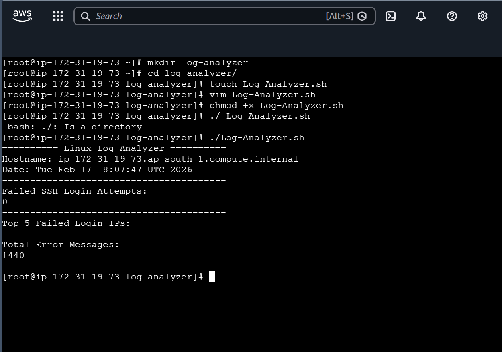

# Linux Log Analyzer :

A Bash-based Linux Log Analyzer that parses system logs to identify:
- Failed SSH login attempts
- Frequent error messages
- Suspicious IP activity

## Technologies Used :
- Bash
- Linux (Amazon Linux)

## How to Run :
#give execute permission through below command :
chmod +x log_analyzer.sh

#after permission run using below syntax :
./log_analyzer.sh

##ScreenShots :

#Result :
The result was an automated log analysis tool that reduces manual log checking effort and quickly highlights failed login attempts and system errors, improving troubleshooting efficiency and server monitoring.

#You Can Connect With Me
# 👤  LinkedIn 
🔗 LinkedIn: https://www.linkedin.com/in/muskaan-tandel-b59bb8343/

